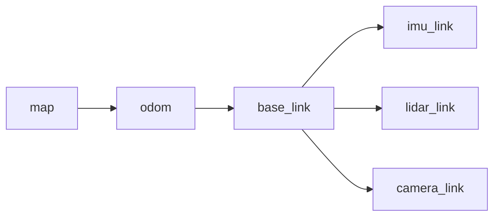

# zenode conventions

Units, coordinate frames, time, and key naming. This is the portable part of a
distributed robot system — the part two teams get wrong independently, and the
part that cannot be caught by a type checker because everything is `float`.

**Status: normative for `zenode.msgs` and for zenode-owned keys; advisory for
application contracts.** `zenode.msgs` complies today; new messages must, and
that is the point of writing it down.

zenode standardizes *conventions*, not *topic keys* — see §7 for why the second
one is deliberately absent.

Where a rule matches ROS practice, the REP is cited. Compatibility with ROS
is not a goal in itself, but these particular conventions were argued out over
a decade by people with more robots than us, and the cost of differing is
paid at every integration.

---

## 1. Units

SI, always, on the wire. No exceptions, including for values a human will read.

| Quantity | Unit | |
|---|---|---|
| Length | metre | m |
| Angle | **radian** | rad |
| Time | second | s |
| Linear velocity | metre/second | m/s |
| Angular velocity | **radian/second** | rad/s |
| Linear acceleration | metre/second² | m/s² |
| Mass | kilogram | kg |
| Force / torque | newton, newton-metre | N, N·m |
| Voltage / current | volt, ampere | V, A |
| Temperature | **degree Celsius** | °C |
| Charge fraction (SoC) | **0.0–1.0**, not percent | — |

Follows REP-103, with two additions REP-103 does not cover: Celsius (kelvin is
correct SI and useless in a robot log) and state-of-charge as a fraction.

**Degrees are a presentation format.** They may appear in config files, CLI
output, and UIs; they are converted at that boundary and never travel in a
payload. A field named `*_deg` on a message is a bug — the units are not in the
name, they are in this document, and a name that has to carry them is a sign
the convention was not followed.

**Percent likewise.** `soc: float = 0.87`, not `87`. A field that can be read as
either is the single most common unit bug in battery handling.

## 2. Coordinate frames

**Right-handed, everywhere.** Positive rotation about an axis is counter-clockwise
when looking down that axis toward the origin.

**Body frame: FLU** — x **F**orward, y **L**eft, z **U**p.
**World frame: ENU** — x **E**ast, y **N**orth, z **U**p.

So on a ground robot: driving forward is `+x`, turning left is `+z` angular,
strafing left is `+y`. This matches REP-103, and it is why `Twist.angular.z` is
yaw rate and `Pose2D.theta` is yaw — both radians, both counter-clockwise-positive.

Aerospace FRD/NED is the other defensible choice and is *not* used here. If you
integrate a component that speaks NED (many IMUs and flight controllers do),
convert it in the driver node. The conversion belongs at the hardware boundary,
not in every consumer.

**Quaternions are xyzw**, in that order, and unit length.

```python
Quaternion(x=0.0, y=0.0, z=0.0, w=1.0)  # identity — the default
```

The `w`-last order matches ROS and Eigen's storage order; `w`-first matches
much of the aerospace and graphics literature. Both are common, neither is
"right", and a mismatch produces a rotation that looks *almost* correct, which
is worse than one that is obviously broken. Hence: state it, default to
identity, and never accept a quaternion whose order you have not checked.

**Producers normalize; consumers may assume normalized.** A non-unit quaternion
on the wire is a producer bug. Consumers are not required to re-normalize
defensively, and messages carry no flag for it.

## 3. Frame names

`frame_id` is a plain string. The standard chain, per REP-105:



| Name | Meaning |
|---|---|
| `map` | World-fixed. Discontinuous — jumps when localization corrects. Long-term accurate. |
| `odom` | World-fixed, **continuous** — never jumps, drifts without bound. |
| `base_link` | Rigidly attached to the robot body, at its rotation centre. |
| `<sensor>_link` | Rigidly attached to a sensor, e.g. `lidar_link`, `imu_link`. |

The `map`/`odom` split is the one worth internalizing: a control loop must
consume `odom` (continuous, so a localization correction cannot produce a step
change in the error term), while a goal or a map lookup must use `map`. Merging
them into one "pose" topic is the bug this naming exists to prevent.

zenode ships **no transform tree**. That is inside the scope fence — there is
no TF, no interpolation, no lookup graph. `Transform` carries `frame_id` and
`child_frame_id` so that a payload states what it is relative to; composing
transforms is the application's job.

## 4. Time and provenance

**Rule: time and provenance live in the `Envelope`; spatial frame lives in the
payload.**

`Envelope` already carries `node` (sender), `seq`, `ts_ns` (publish time), and
`traceparent`. A message therefore does **not** carry a ROS-style `Header`:

- No `stamp` field. Use `Envelope.ts_ns` / `Envelope.age_s()`.
- No `seq` field. Use `Envelope.seq`.
- **Do** carry `frame_id` when the payload is spatial — the transport cannot
  know it.

Two timestamps that can disagree is a debugging trap, and a payload `stamp` is
guaranteed to disagree eventually — someone will construct a message once and
publish it twice. `Transform` is the reference shape for a compliant spatial
message.

The exception is a payload whose timestamp is *not* its publish time:
a measurement captured at t₀ and published at t₁ after processing. Then a
payload field is correct, and it must be named for what it is
(`captured_ts_ns`), never `stamp`.

**Two clocks, two purposes:**

| | Clock | Used by | Breaks when |
|---|---|---|---|
| `Envelope.ts_ns`, `age_s()`, `Topic.max_age` | wall (`time.time_ns`) | *Is this message too old to act on?* | hosts are not NTP-synced |
| Subscription `deadline` | monotonic (`loop.time`) | *Has anything arrived at all?* | never |

Wall clock is unavoidable for cross-host age — a monotonic clock is meaningless
between machines. Anything measurable locally uses monotonic. See
`subscription-deadlines.md`.

## 5. Key naming

Keys are hierarchical, `/`-separated, lower `snake_case` segments, and
**relative** — the deployment namespace is prefixed at runtime, so the same
contract runs on N robots.

**`node/` is reserved by zenode.** It holds the runtime's own keys and an
application must not publish there:

| Key | Owner |
|---|---|
| `<ns>/node/<name>` | liveliness token (`presence.py`) |
| `<ns>/node/<name>/health` | `NodeHealth` heartbeat |

Everything outside `node/` belongs to the application. The suggested shape,
which zenode does not enforce and will not:

| Prefix | Contents |
|---|---|
| `command/` | Actuation requests. Usually `max_age`, rarely `latched`. |
| `state/` | What the robot currently is. Usually `latched`. |
| `sensors/` | Raw measurements. High rate, often `RawCodec`. |

Group by *kind*, not by producing node: `state/battery`, not `bms/battery`.
Node names change when code is refactored; the kind of data does not, and a key
that encodes its producer forces a wire-breaking rename every time you split a
node.

Keys owned by an outside system — a vendor driver, another stack — use
`Topic.absolute`, which bypasses the namespace:

```python
lidar = Topic.absolute("livox/lidar", bytes)  # RawCodec by default
```

## 6. What belongs in `zenode.msgs`

Admission criterion: **the type must have a convention worth standardizing.**
Not "is it common" — commonness is not the point, *agreement* is. A struct of
three floats is not hard to write yourself; the reason to centralize one is
that two teams will independently disagree about its units, axis order, or
frame semantics.

Applying it:

| Type | In | Why |
|---|---|---|
| `Vector3`, `Quaternion`, `Pose`, `Pose2D`, `Twist`, `Transform` | ✅ shipped | Handedness, axis order, quaternion order |
| `NodeHealth` | ✅ shipped | zenode's own contract |
| `Odometry` | candidate | Which frame (§3) is exactly what people get wrong |
| `Imu` | candidate | Axis order and units are the whole content of REP-145 |
| `JointState` | candidate | By-name vs by-index ordering is a classic silent bug |
| `BatteryState` | candidate | SoC as fraction vs percent (§1) bites everyone once |
| `LaserScan` | ✗ | Beyond "radians and metres" there is nothing to agree on |
| Images, point clouds | ✗ | `bytes` + `RawCodec`; the codec choice dominates and no convention exists to encode |
| Robot commands, nav types, mission state | ✗ | Application domain — belongs in its own contract, where it evolves with the robot |

Additional rules for anything admitted:

- **No `Header`** (§4).
- **No covariance** until a real consumer needs it. It triples the model and
  JSON-serialising 36 floats per odometry message is measurable bandwidth.
- **Every field defaulted**, so a partially-known message is constructible —
  the existing messages all do this.
- **Compliance asserted in the module docstring**, as `geometry.py` does:
  *"right-handed, SI units, quaternions in xyzw order"*.

## 7. What zenode deliberately does not standardize

**Topic keys.** There is no `StandardTopics.cmd_vel`, and there will not be.

A `Topic` binds key + schema + codec + `latched` + `max_age` + `trace`. Only the
schema is universal; the rest is deployment policy — `max_age=0.5` on a velocity
command is wrong for both a slow tracked vehicle and a drone.

The key string in particular is the worst field to freeze. Changing a shipped
key breaks the wire **silently**: no exception, no type error, just two nodes
that never hear each other. And a half-adopted standard is worse than none — a
`StandardTopics` that the flagship consumer ignores is dead weight that
misleads every newcomer reading the README.

ROS is the precedent, not the counterexample: it ships `geometry_msgs/Twist`
and has never shipped a typed constant for `/cmd_vel`. Its interop value comes
from REP-103 and REP-105 — documents like this one — plus remapping at launch.

**The consequence for reusable nodes:** a node meant to run on more than one
robot takes its `Topic` as a constructor argument rather than importing a
global.

```python
class Teleop(Node):
    name = "teleop"

    def __init__(self, *, cmd_topic: Topic[Twist], **kw):
        super().__init__(**kw)
        self._cmd_topic = cmd_topic

    async def on_start(self) -> None:
        self.cmd = self.publisher(self._cmd_topic)
```

That node works on every deployment, including ones predating any standard —
which a hardcoded key never would. `harness.start_node(cls, **kwargs)` passes
the same way, so it stays testable.

For a starting point, copy `examples/contract.py` rather than importing
anything. Copying beats inheriting for deployment-specific declarations: no
version coupling, and the first thing a newcomer does is edit the keys instead
of discovering three weeks later that they inherited someone else's `max_age`.

## 8. Changing a convention

Units, handedness, and quaternion order are **wire-breaking and silent** — a
consumer reading the old convention gets plausible numbers, not an error. So:

1. Do not change one to fix a single integration. Convert at that boundary.
2. If a change is genuinely warranted, it needs a message-level rename
   (`PoseV2`, or a new key), never an in-place redefinition. A field that means
   something different in 0.3 than in 0.2, under the same name, is undebuggable.
3. Key-naming and `zenode.msgs` admission (§5, §6) are soft — they can be
   revised in a release note.

## Checklist

For a new message in `zenode.msgs`:

- [ ] Has a convention worth standardizing (§6), not just common
- [ ] SI units; no `*_deg`, no percent (§1)
- [ ] Right-handed; FLU body / ENU world; quaternions xyzw (§2)
- [ ] `frame_id` present if spatial; no `stamp`, no `seq`, no `Header` (§4)
- [ ] No covariance unless a consumer exists
- [ ] All fields defaulted
- [ ] Module docstring asserts compliance

For a new topic in an application contract:

- [ ] Relative key, `snake_case`, grouped by kind not by producer (§5)
- [ ] Not under `node/`
- [ ] `latched=True` for state a late joiner must see
- [ ] `max_age` only where a stale message is *wrong* — and only with synced clocks (§4)
